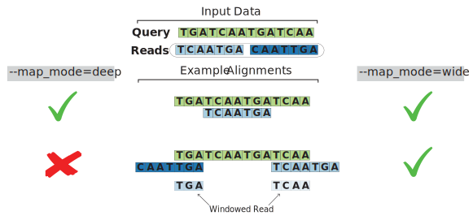

# ContigConstructor

## Motivation

Contigs are a series of overlapping DNA sequences which assemble to represent a larger DNA region within a chromosome. [1](https://www.genome.gov/genetics-glossary/Contig). Often times in genomic research we might encounter a DNA sequence of interest. The surrounding sequence environment can impart significant effect on the ability for genomic information to propagate through the central dogma of molecular biology (DNA->RNA->Protein). Accordingly, we wish to define the surrounding milieu for our DNA sequence of interest to potentially identify transcriptional factors. Unfortunately, most modern DNA sequencing methods return short read sequences that can be ambiguous and computationally mapping of these to other relatively short sequences can be computationally expensive. Here we present a fast and memory efficient solution, ContigConstructor, which is particularly well-suited for large search spaces.

## Methodology

ContigConstructor relies on a tree data structure known as a [van Emde Boas (vEB) tree](http://web.stanford.edu/class/archive/cs/cs166/cs166.1146/lectures/14/Small14.pdf) which stores information as an associate array. This methodology is utilized because it is highly space efficient and can be processed in parallel with `INSERT` and `SEARCH` methods in constant time. Given a query sequence and population of candidate sequences we first determine all unique sequence lengths in the candidates. We then use a sliding window for every unique length to store hashed subsequences and their start and stop indices in the vEB tree. We then search for all candidate sequences in the vEB tree to collect the query indices in which there are matches. The largest extension possible is calculated using the indices and read lengths and the contig is extended accordingly. Unused reads are recycled and the process repeats until there are no longer any matching reads.

### Dependencies

ContigConstructor was specifically built under <b>Python 3.6.8</b> and uses <b>NumPy 1.17.2</b>. While this can not be guaranteed, we expect that ContigConstructor can be run on Python 3+.

## Easy Install

Assuming dependencies have been met, ContigConstructor can utilized with the following simple commands:

```
cd <DESTNATION-DIR>
git clone https://github.com/princeew/contigconstructor
cd ./contigconstructor
```

## Usage

The main script for ContigConstructor is `./build_contig.py`. It can be executed from the command line using the following specifications:

```
usage: build_contig.py [-h] --query_file_path QUERY_FILE_PATH --test_file_path
                       TEST_FILE_PATH --save_path SAVE_PATH [--bidirectional]
                       [--map_mode {wide,deep}] [--subsample_n SUBSAMPLE_N]
                       [--random_seed RANDOM_SEED] [--verbose]

optional arguments:
  -h, --help            show this help message and exit
  --query_file_path QUERY_FILE_PATH
                        Path to FASTA formatted file containing single query
                        sequence. This sequence is the starting seed for
                        contig growth.
  --test_file_path TEST_FILE_PATH
                        Path to FASTA formatted file containing sequencing
                        reads. These reads are what will be mapped to the
                        query sequence. NOTE: Reads are expected to be
                        preprocessed for trimming adapter sequences.
  --save_path SAVE_PATH
                        Path to directory where output files will be saved.
  --bidirectional       Reads in test_file_path will be read in both
                        directions (L to R and R to L).
  --map_mode {wide,deep}
                        Whether to extend the contig by creating windowed
                        reads, or only map full matches within the query
                        sequence.
  --subsample_n SUBSAMPLE_N
                        Integer number to sample reads from test_file_path.
                        This can help speed up the algorithm.
  --random_seed RANDOM_SEED
                        Seed for random number generator. Only important if
                        subsample_n > 0.
  --verbose             Print status updates as algorithm is running.
  
```

Note that `--map_mode` is used to set how reads can be aligned. The figure toy example below describes a scenario with a query sequence and two candidate reads. ContigConstructor is able to extend the contig left and right by creating <i>windowed reads</i>. Meaning, that we create sliding window reads of both the query and candidate reads such that we can identify matches on the edges. Because of repeating elements when a windowed read is identified we perform a logical check that a positive match is correctly located on the query. This avoid the potential for erroneously mapping short reads on the interior of the query sequence. When `--map_mode=deep`, only matches that are fully contained within the boundaries of the query are considered a match. This assumes that the length of the query is greater than the lengths of the candidate reads. Interior full matches are also considered positive matches when `--map_mode=wide`, but there is a high likelihood that a given full match sequence will have one or more smaller windowed read matches and will be used to extend the contig instead.

<p align="center">
  
</p>

### Input File Format

Both `QUERY_FILE_PATH` and `TEST_FILE_PATH` are required to be in FASTA format. For example the query file might look like like the following:

```
>INITIAL_QUERY
GGGATCGGCCATTGAACAAGATGGATTGCACGCAGGTT
```

And the file provided to `TEST_FILE_PATH` might look like:

```
>2S43D:03629:08794
TTCAGGCTCTGGCATGCATTAGAAATGTGGCTTG
>2S43D:08938:01257
GGGTGGTCCCCCTCCTTTACTTGTAACGTTGTCCTAAG
```

### Outputs


## Example

The following command will execute a subsampled run on example data:

```
python build_contig.py \
--query_file_path=./examples/data/QUERY.fasta  \
--test_file_path=./examples/data/READS.fasta \
--save_path=./examples/contig/ \
--bidirectional \
--map_mode=wide \
--subsample_n=1000 \
--verbose
```

Example outputs can be found under `./examples/contig/`.

## Limitations

### Low-Complexity Regions

### Sequence Read Quality

### Phase 1 Limitations

The current implementation (Phase 1) only performs one pass over the reads provided to TEST_FILE_PATH,

## Troubleshooting

Please report any issues, comments, or questions to Eric Prince via email Eric.Prince@CUAnschutz.edu, or [file an issue](https://github.com/princeew/contigconstructor/issues).
